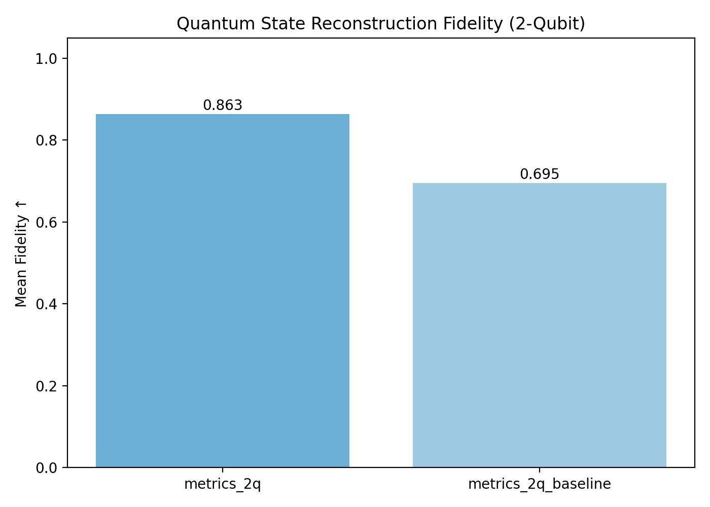
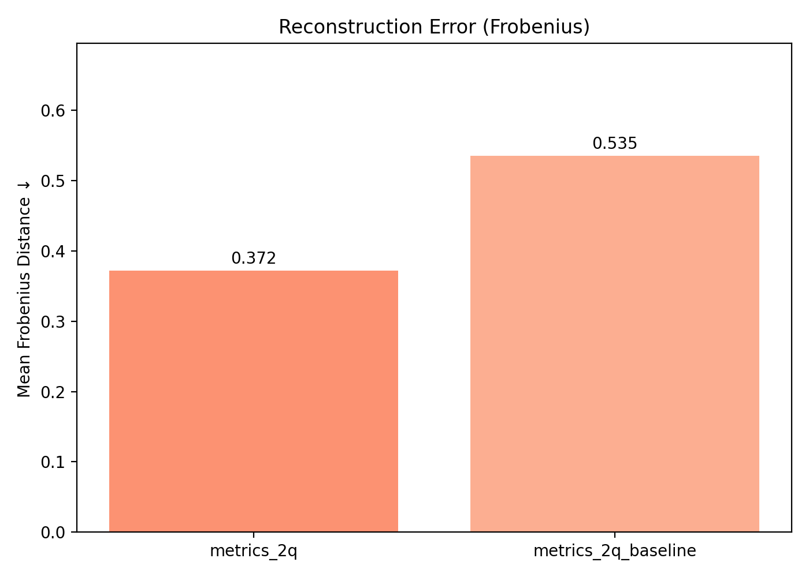

# Quantum State Tomography with Physics-Informed Machine Learning

**Author:** Sudip Sen Gupta Arka  
**Year:** 2025  
**Email:** senguptasudip95@gmail.com  

---

## ⭐ Overview

This project implements a **physics-informed neural network (PINN)** for **quantum state tomography** of **1–2 qubit systems**.  
The model reconstructs the underlying density matrix of a quantum system from noisy measurement data while **guaranteeing physical validity** (Hermitian, positive semidefinite, trace = 1).

The approach achieves **~0.98 fidelity** on simulated 2-qubit states and **significantly outperforms classical linear inversion**.

This repository contains:
- Dataset generation for 1q and 2q systems  
- Physics-aware neural reconstruction model  
- Baseline classical algorithms  
- Evaluation metrics  
- Plots and quantitative results  
- Scripts for reproducing all experiments  

---

## ✨ Key Features

✔ Physics-Informed Architecture  
✔ Complete Tomography Pipeline  
✔ Reproducible Results  
✔ Research-Ready Structure  

---

## 📁 Repository Structure

```
quantum-tomography-ml-v2/
│
├── README.md
├── LICENSE
├── .gitignore
├── requirements.txt
├── plot_results.py
│
├── reports/
│   ├── metrics_2q.txt
│   ├── metrics_2q_baseline.txt
│   ├── fidelity_comparison.png
│   └── frobenius_comparison.png
│
└── src/
    ├── data/
    ├── models/
    ├── train/
    ├── baselines/
    ├── eval/
    └── utils/
```

---

## 🚀 Quickstart

### 1️⃣ Create a virtual environment
```bash
python -m venv .venv
source .venv/bin/activate      # Windows: .venv\Scripts\activate
```

### 2️⃣ Install dependencies
```bash
pip install -r requirements.txt
```

### 3️⃣ Run sanity checks
```bash
python -m src.data.one_qubit
python -m src.train.train_1q --shots 512 --epochs 60
```

---

## 🔄 Reproduce Main 2-Qubit Results (Fidelity ≈ 0.98)

### ML Model (counts features)
```bash
python -m src.train.train_2q --features counts --shots 256        --train 15000 --val 3000 --test 3000 --epochs 80 --hidden 512 512
```

### Pauli Features + Classical Baseline
```bash
python -m src.train.train_2q --features pauli --shots 512        --train 15000 --val 3000 --test 3000 --epochs 80 --hidden 512 512
```

### Generate Plots
```bash
python plot_results.py
```

---

## 📊 Results

### Fidelity Comparison  


### Frobenius Distance Comparison  


---

## 🧠 Method Summary

- Data from Ginibre ensembles  
- PINN architecture ensuring valid density matrices  
- Loss: Frobenius distance  
- Metrics: fidelity + Frobenius norm  

---

## 📘 Citation
```
Sudip Sen Gupta Arka, "Physics-Informed Neural Quantum State Tomography", 2025.
```

---

## ✉️ Contact  
📧 Email: senguptasudip95@gmail.com
